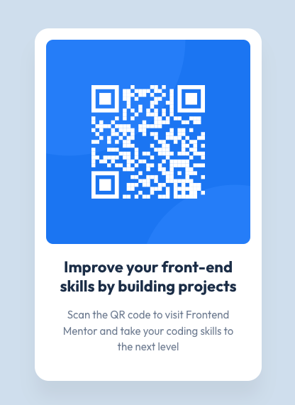

# Frontend Mentor - QR code component solution

This is a solution to the [QR code component challenge on Frontend Mentor](https://www.frontendmentor.io/challenges/qr-code-component-iux_sIO_H). Frontend Mentor challenges help you improve your coding skills by building realistic projects. 

## Table of contents

- [Frontend Mentor - QR code component solution](#frontend-mentor---qr-code-component-solution)
  - [Table of contents](#table-of-contents)
  - [Overview](#overview)
    - [Screenshot](#screenshot)
    - [Links](#links)
  - [My process](#my-process)
    - [Built with](#built-with)
    - [What I learned](#what-i-learned)

## Overview

### Screenshot

### Links

- Solution URL: [Add solution URL here](https://your-solution-url.com)
- Live Site URL: [https://qr-code-component-phi.vercel.app](https://qr-code-component-phi.vercel.app)

## My process

### Built with

- HTML
- CSS, SCSS
- Flexbox

### What I learned

It was the first time I used SASS outside of of a React project, for which I usually work from a starter model that is already set up for all the extensions I need. I realised that here `styles.scss` had to be pre-compiled and I used the extension [Live Sass Compiler](https://marketplace.visualstudio.com/items?itemName=glenn2223.live-sass) in VSCode to do it.

I struggled a bit to center the main container vertically so I decided to use Flexbox, and that did the job very easily.
